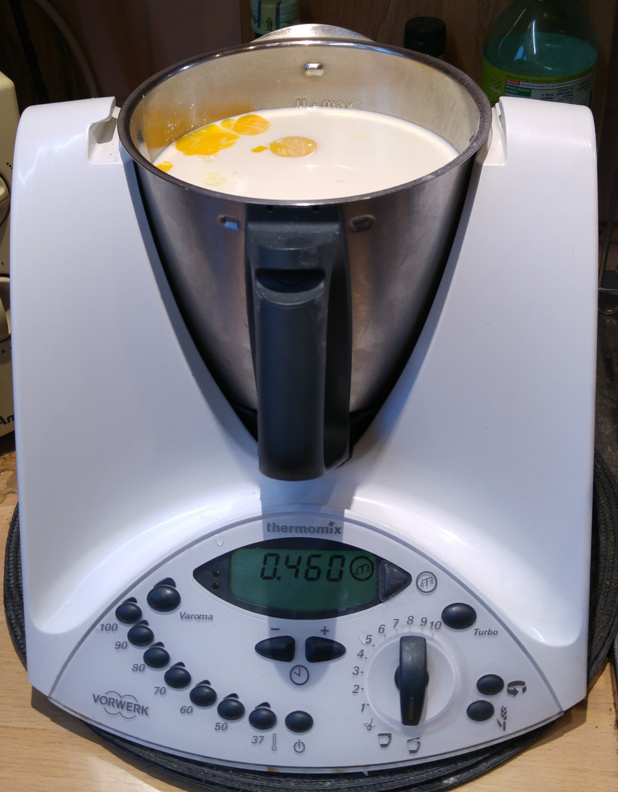

# My birthday cake
This is a repository containing the source code for the cake which I ~~cooked~~ compiled for my co-employees at my work at the occasion of my 24th birthday. It's a "sernik rosa" ("dew" cheesecake).

# Source code
You'll find it in `src/` directory.

## Some extra notes when building:
* Temperature setting on a gas cooker should be somewhere around "4", which according to it's user manual corresponds to around 185 °C. You can probably set it to less if you have a cooker with thermo-circulation.
* Actual mass of quark for "Cheese compound" portion was more like 800g according to my edtor's scale, but advertised mass was 1000g. Also, slightly less milk and oil was used since my editor can't handle all the code at once.

# Tools used
My code editor of choice for this project was a Thermomix TM31:

I know, it's not open source nor free, but I've yet to find an Open Source alternative. If you do know such an alternative, please let me know.

My compiler of choice was a gas (methane or sth) powered Mastercook-Wrozamet [^1] cooker, though any big enough cooker will make probably do. Also, to friends-by-trade: Please don't use the cooker you use for SMT reflow and cooking dead graphic cards. Lead and flux fumes are nasty, or so I've been told.
[^1]:(Made in Poland!)

# Known issues
* The source code is written in Polish. If you need it ported to English, create an Issue and I'll do it.
* It's also a photo, 'cause I was too lazy to put it through an OCR or find a corresponding recipe online. Here's one if you need it: [PDF24 Tools' online OCR](https://tools.pdf24.org/pl/ocr-pdf)
* The command snippets included in the source code (y'know, those funny icons on my editor's UI) might not work in some other editors. If you want to go full manual Assembly mode, create an issue and I'll try to describe their function so you can reverse-engineer them into your code.
* Compiler options might be different if you have those funny new compilers with thermocirculation or an electric one. Some DIY skills might be required to adapt the compile process.

